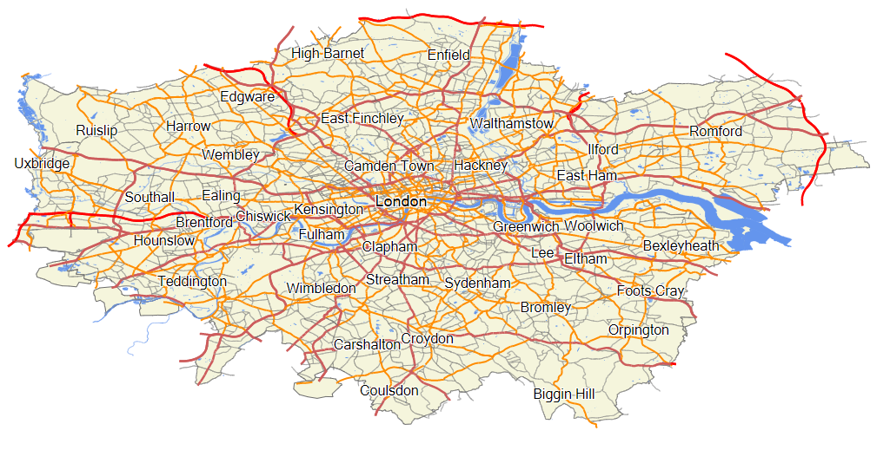
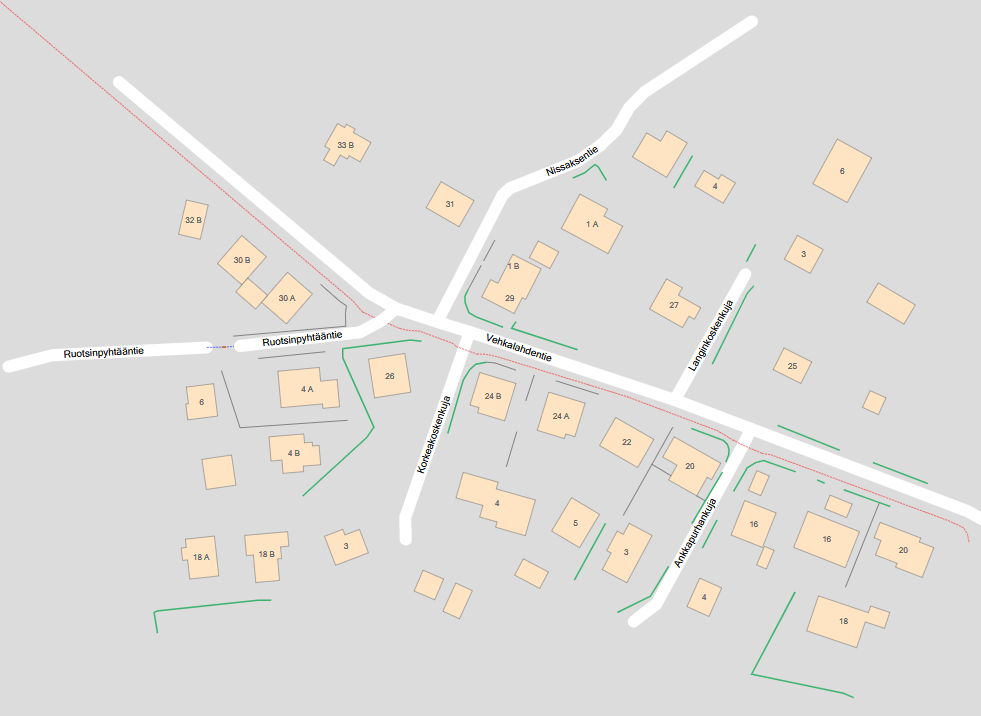
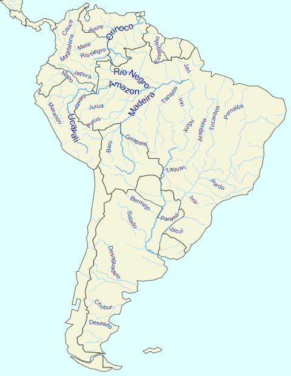






{{< blocks/products/pf/sub-menu logoImageSrc="https://www.aspose.cloud/templates/aspose/App_Themes/V3/images/gis/272x272/aspose_gis-for-net.png" liveDemosLink="https://products.aspose.app/gis/family" PricingLink="https://purchase.aspose.com/pricing/gis/net" buyLink="https://purchase.aspose.com/pricing/gis/net" docsLink="https://docs.aspose.com/gis/net/" installationsDocsLink="https://docs.aspose.com/gis/net/installation/" nugetLink="https://www.nuget.org/packages/Aspose.GIS/" nugetPackageName="Aspose.GIS" mavenRepoLink="" directDownloadLink="https://downloads.aspose.com/gis/net" >}}



 Aspose.GIS for .NET enables you to create map viewer for vector-based and raster geospatial data formats.

 Aspose.GIS for .NET is designed with simplicity, performance, usability &amp; portability in mind. It contains APIs to be used with .NET Framework &amp; .NET Core platforms, enabling you to build cross-platform applications with great ease.



<!--Diagrams Start-->




 

  

   <header>
    <i class="fa fa-database">
    </i>
    Styling (color, sizes, etc.)
   </header>
   <ul>
    <li>Point Symbolizer</li>
    <li>Line Symbolizer</li>
    <li>Fill Polygons</li>
    <li>Point Clustering</li>
    <li>Use Picture in Points</li>
   </ul>
   <header>
    <i class="fa fa-calculator">
    </i>
     Advanced Symbolizers
   </header>
   <ul>
    <li>Combine Layers</li>
    <li>Combine Symbolizers</li>
    <li>Geometry Generator</li>
    <li>Mixed Geometry</li>
   </ul>
  

  <!--/left-->
  

   <header>
    <i class="fa fa-random">
    </i>
    Labeling
   </header>
   <ul>
    <li>Auto Detect Places</li>
    <li>Draw along curved lines</li>
   </ul>
   <header>
    <i class="fa fa-map">
    </i>
    Output Formats
   </header>
   <ul>
    <li>SVG</li>
    <li>PNG</li>
    <li>BMP</li>
    <li>JPEG</li>
   </ul>
   <header>
    <i class="fa fa-globe">
    </i>
    Other
   </header>
   <ul>
    <li>Import from SLD</li>
   </ul>
  

  <!--/right-->
 

 <!--/row-->
 

  
  <header>
   Aspose.GIS
  </header>
  <footer>
   <small>
    <em>
     for
    </em>
    .NET
   </small>
  </footer>
 

 <!--/logo-->





 

  

   <header>
    <i class="fa fa-windows">
    </i>
    Windows
   </header>
   <ul>
    <li>
     .NET Framework 4.7 or later
    </li>
    <li>
     .NET Core 2.0 or later
    </li>
   </ul>
  

  <!--/left-->
  

   <header>
    <i class="fa fa-linux">
    </i>
    Linux
   </header>
   <ul>
    <li>
     .NET Core 2.0 or later
    </li>
   </ul>
  

  <!--/right-->
 

 <!--/row-->
 

  
  <header>
   Aspose.GIS
  </header>
  <footer>
   <small>
    <em>
     for
    </em>
    .NET
   </small>
  </footer>
 

 <!--/logo-->



 

  

   <header>
    <i class="fa fa-random">
    </i>
    Vector files in GIS
   </header>
   <ul>
    <li><b>ESRI Shapefile:</b>SHP, SHX, DBF</li>
    <li><b>GeoJSON:</b>JSON, GeoJSON</li>    
    <li><b>TopoJSON:</b>JSON, TopoJSON</li>
    <li><b>ESRI File Geodatabase:</b>GDB</li>
    <li><b>Geography Markup Language:</b>GML</li>
    <li><b>Google Earth:</b>KML</li>
    <li><b>GPS Exchange Format:</b>GPX</li>
    <li><b>MapInfo Interchange Format:</b>MIF</li>
    <li><b>MapInfo Tab Format:</b>TAB, DAT, DBF</li>
    <li><b>OpenStreetMap:</b>OSM</li>
   </ul>
  

  <!--/left-->
  

   <header>
    <i class="fa fa-random">
    </i>
    Raster files in GIS
   </header>
   <ul>
    <li><b>GeoTIFF:</b> TIF, TIFF</li>
    <li><b>Esri ASCII / Esri grid:</b>ASCII</li>
   </ul>
   <header>
    <i class="fa fa-map">
    </i>
    Web Tiles
   </header>
   <ul>
    <li><b>XYZ Tiles:</b>Slippy Maps</li>
   </ul>
   <header>
    <i class="fa fa-database">
    </i>
    Databases
   </header>
   <ul>
    <li><b>PostgreSQL (PostGIS)</b></li>
    <li><b>SQL Server (MS SQL)</b></li>
   </ul>
  

  <!--/right-->
 

 <!--/row-->
 

  
  <header>
   Aspose.GIS
  </header>
  <footer>
   <small>
    <em>
     for
    </em>
    .NET
   </small>
  </footer>
 

 <!--/logo-->




<!--Diagrams End-->

<!--Feature-section Start-->

 
 

  

   <h2 class="pr-ft">
    Advanced GIS Data Manipulation API Features
   </h2>
   

   

   

   

   

    <h2 class="h2title">
     Render Maps
    </h2>
    

     Data is only useful when someone can see it. .NET GIS library makes it easy and fast to export GIS data to vector or raster images and provides rich symbology for complex visualization scenarios.
    

    

     <h3>
      Render a TopoJSON map to SVG - C#
     </h3>
     <pre><code class="cs">using (var map = new Map(800, 600))

{

    var layer = VectorLayer.Open(dir + "map.json", Drivers.TopoJson);

    var style = new SimpleFill { FillColor = Color.Azure, StrokeWidth = 1.5 };

    map.Add(layer, style);

    map.Render(dir + "mymap.svg", Renderers.Svg);

}</code></pre>
    

   

  

 

<!--Feature-section End-->



























